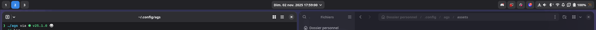
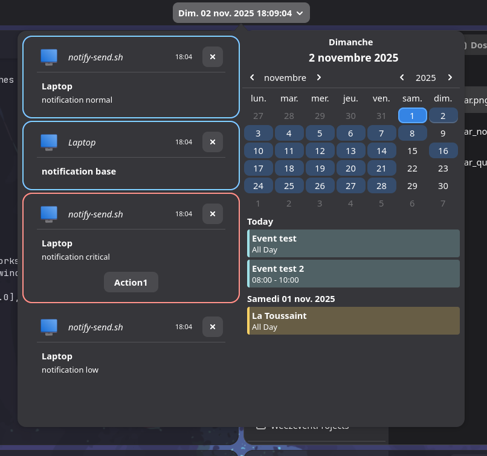

# Agwaita

A GTK Shell configuration that combines Adwaita and AGS.

## Dependencies

- [Ags](https://aylur.github.io/ags/)
- [Niri](https://yalter.github.io/niri/) (because it's my main WM at the moment)
- glib2 for using gsettings
- pavucontrol (because I haven't yet developed the part for managing sound/microphone devices)
- kvantum with kvantum-qt5 and kvantum-theme-libadwaita for using kvantummanager
- swaylock and a preparation script
  `$XDG_LIB_HOME/desktop-scripts/prelock` (the latter is not published because it is only used to take a screenshot and pixelate it for swaylock, and can be replaced by anything else)
- systemd for using:
    - systemctl
    - loginctl
    - systemd-networkd (because I never liked NetworkManager)
- nushell for the make.nu file

## Installation

1. Install the required dependencies
2. Clone this repository
3. Put in the PATH: XDG_BIN_HOME or the `$HOME/.local/bin` folder
4. At the root of the project:
    - Run the command `./make.nu -h` to see your options
    - Run the command `./make.nu -h` to see your options
    - Run the command `./make.nu hotrun` to test ags-shell without installation
    - Run the command
      `./make.nu install` to install ags-shell in the $XDG_BIN_HOME folder or the
      `$HOME/.local/bin` folder, which allows you to access the
      `ags-shell` command in your PATH

## Preview

https://github.com/user-attachments/assets/c62d139e-97db-40b1-9957-5b8bfa0a4d12

### Notifications system

### Status bar

### Notifications center

### Quick settings

## Roadmap

See [Agwaita's project](https://github.com/users/gouvinb/projects/4)

# Credits

- [Gnome](https://www.gnome.org/) for Adwaita, gjs, and shell design
- [ags](https://aylur.github.io/ags/) by Aylur for Ags, Gnim and Astal projects
- [overskride](https://github.com/kaii-lb/overskride) by Kaii-lb for the design of her powerful bluetooth client

# License

Copyright 2025 Gouvinb

Licensed under the Apache License, Version 2.0 (the "License");
you may not use this file except in compliance with the License.
You may obtain a copy of the License at

       http://www.apache.org/licenses/LICENSE-2.0

Unless required by applicable law or agreed to in writing, software
distributed under the License is distributed on an "AS IS" BASIS,
WITHOUT WARRANTIES OR CONDITIONS OF ANY KIND, either express or implied.
See the License for the specific language governing permissions and
limitations under the License.

> See [LICENSE.md](LICENSE.md)
