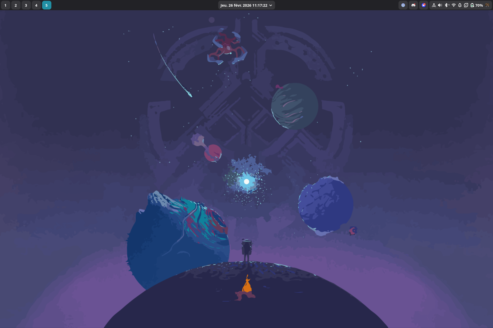
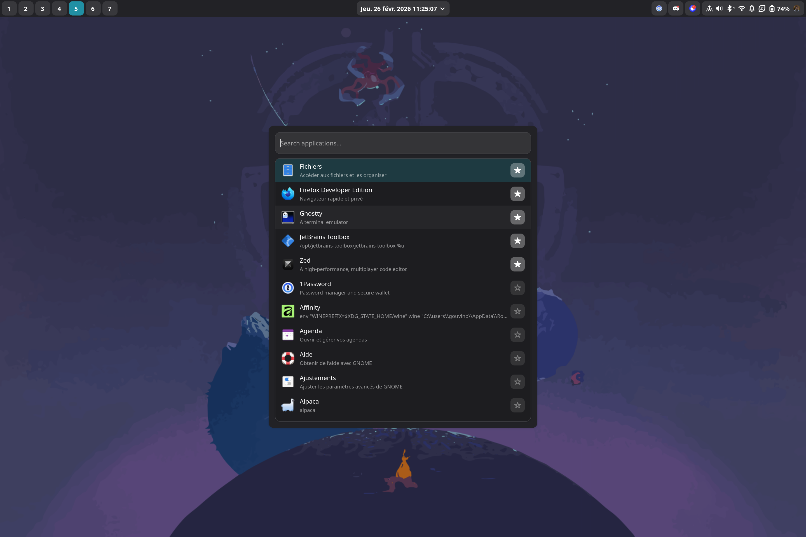
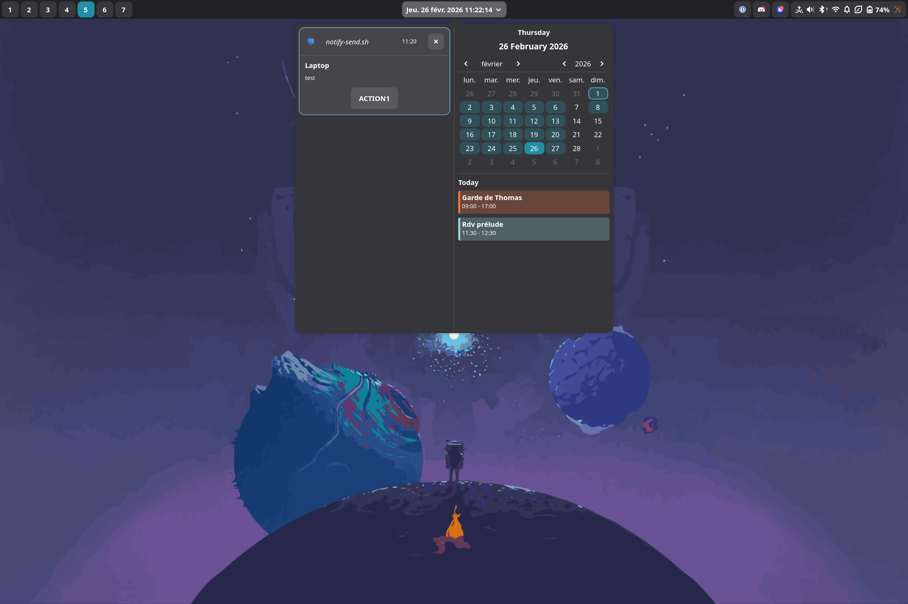
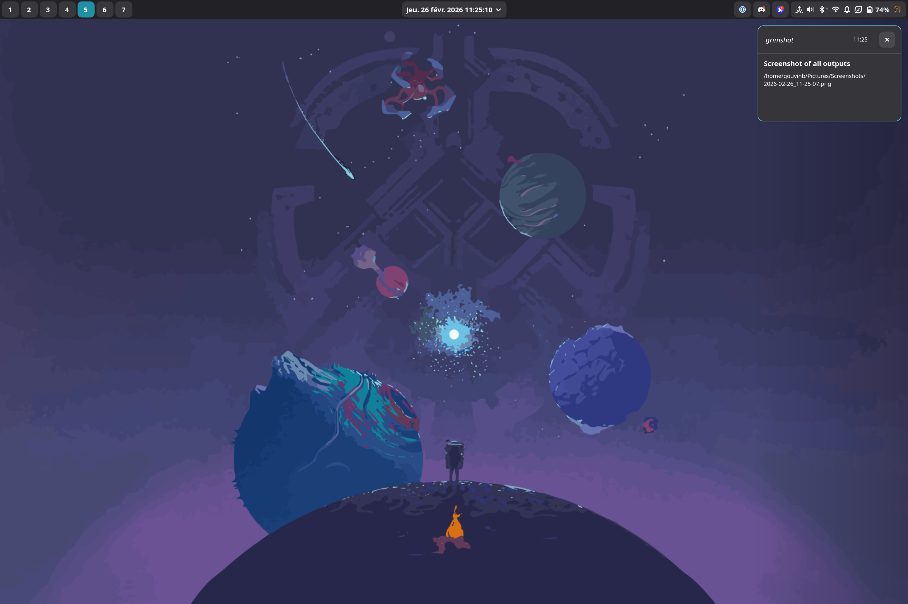
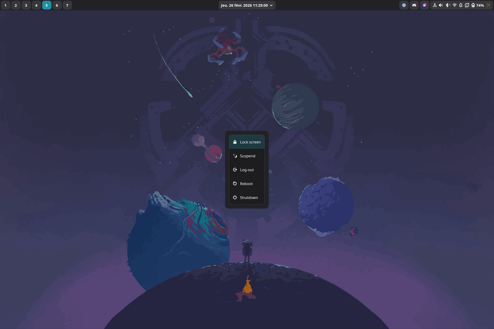
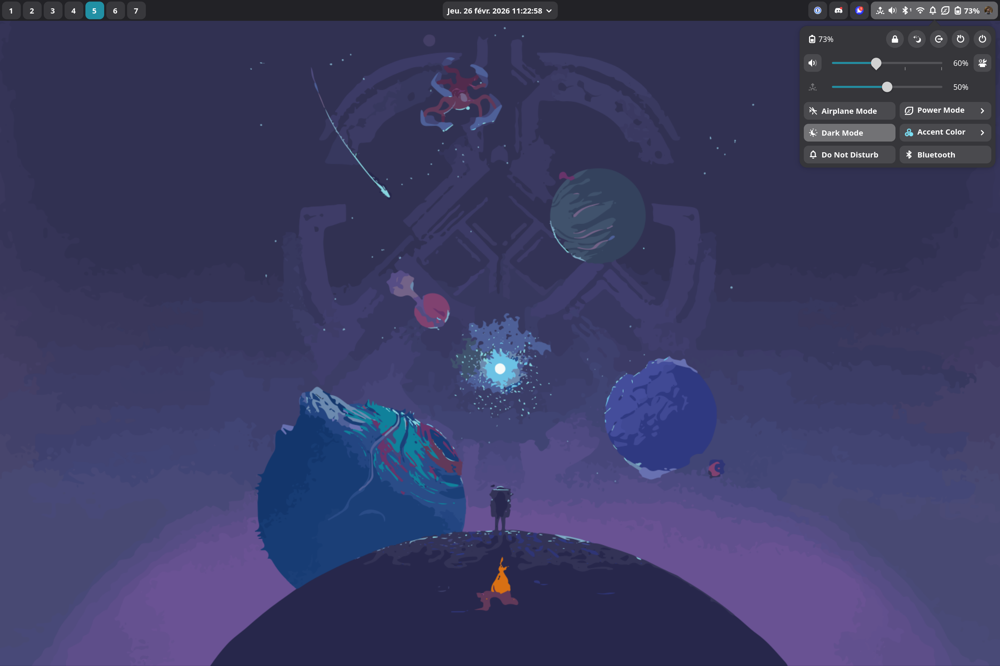

# Agwaita

Previously, a GTK Shell configuration that combines Adwaita and AGS now in Rust.

## Dependencies

### System Dependencies and dev environment

- Latest stable Rust version
- [Niri](https://yalter.github.io/niri/) - Wayland compositor (currently the main compositor used for development)
- GTK4 and Libadwaita system libraries
- gtk4-layer-shell - Layer Shell protocol library
- D-Bus for inter-process communication
- Nushell (for running `make.nu` build scripts)

### Rust Dependencies

#### Core

- `catalyser` - Procedural macros for code generation
- `log` - Logging facade for structured logging throughout the application
- `pretty_env_logger` - Pretty, colorized logger for development

#### CLI

- `clap` - Command-line argument parser with derive macros for the `agwaita` CLI

#### System Integration

- `signal-hook` - Unix signal handling (SIGINT, SIGTERM) for graceful shutdown
- `inotify` - File system event monitoring (used for brightness control and avatar changes)

#### GTK/UI

- `gtk4` - GTK4 bindings for Rust (v4.20 features enabled)
- `relm4` - Elm-inspired reactive GUI framework built on GTK4/Libadwaita
- `relm4-components` - Pre-built components for Relm4
- `gtk4-layer-shell` - Layer Shell protocol support for Wayland compositors (topbar positioning)

#### D-Bus

- `zbus` - Pure Rust D-Bus implementation for system service communication (power profiles, system tray, etc.)

#### Async Runtime

- `futures` - Async utilities and combinators
- `tokio` - Async runtime for D-Bus and other async operations

#### Utilities

- `serde` / `serde_json` - Serialization/deserialization
- `chrono` - Date and time handling with locale support
- `freedesktop-desktop-entry` - Desktop entry file parsing
- `nucleo-matcher` - String normalization and fuzzy matching

#### Calendar Integration

- `calcard` - vCard and iCalendar parsing
- `rrule` - Recurring rule handling for calendar events

#### Compositor Integration

- `niri-ipc` - IPC client for Niri compositor (workspace management)

#### Media and Hardware

- `pipewire` - PipeWire integration for audio monitoring
- `brightness` - Brightness control

## Installation and running

1. Install the required dependencies
2. Clone this repository
3. Put in the PATH: XDG_BIN_HOME or the `$HOME/.local/bin` folder
4. At the root of the project:
    - Run the command `./make.nu -h` to see your options
    - Run the command `./make.nu -h` to see your options
    - Run the command `./make.nu hotrun` to test agwaita without installation
    - Run the command `./make.nu install` to install agwaita in the $XDG_BIN_HOME folder or the `$HOME/.local/bin` folder, which allows you to access the `agwaita` command in your PATH

### Logging and Debugging

Agwaita uses structured logging for developers and system administrators to diagnose issues.

#### Log Levels

By default:
- _Debug builds_: Logs at `Debug` level and above
- _Release builds_: Logging is disabled

You can override the log level using the `AGWAITA_LOG_LEVEL` environment variable:

```bash
# Available levels: trace, debug, info, warn, error, off
AGWAITA_LOG_LEVEL=debug agwaita session
```

#### Reporting Issues with Logs

If you encounter a problem and need to report it, please provide debug logs:

1. Run Agwaita with debug logging enabled:
   ```bash
   AGWAITA_LOG_LEVEL=debug agwaita session 2>&1 | tee agwaita.log
   ```
2. Reproduce the issue
3. Stop Agwaita (Ctrl+C)
4. Attach the `agwaita.log` file to your issue report

Example log output:

```log
[2025-01-31T10:30:45.123Z INFO  agw_service] Starting Agwaita daemon
[2025-01-31T10:30:45.234Z INFO  agw_ui_session] Initializing global system state service
[2025-01-31T10:30:45.345Z DEBUG agw_ui_session::component] Initializing topbars for existing monitors
[2025-01-31T10:30:45.456Z INFO  agw_ui_session::component] Creating topbar for monitor: DP-1
```

## Preview

<details>
<summary>General Preview</summary>

(Add additional information here)



</details>

<details>
<summary>App Launcher</summary>

(Add additional information here)



<video src="assets/video/shell-app_launcher.mp4" controls></video>

</details>

<details>
<summary>Info Center</summary>

(Add additional information here)



<video src="assets/video/shell-info_center.mp4" controls></video>

</details>

<details>
<summary>Notifications</summary>

(Add additional information here)



<video src="assets/video/shell-notifications.mp4" controls></video>

</details>

<details>
<summary>Power Menu</summary>

(Add additional information here)



<video src="assets/video/shell-power_menu.mp4" controls></video>

</details>

<details>
<summary>Quick Settings</summary>

(Add additional information here)



<video src="assets/video/shell-quick_settings.mp4" controls></video>

</details>

## Philosophy and Vision

Agwaita follows a **simple, clear, and comprehensible** philosophy:

### Simplicity First

The primary goal is to create a shell that **works reliably** without unnecessary complexity. For now, this means:

- **No configuration files** - The shell works out of the box with sensible defaults
- **Focus on core functionality** - Get the essentials working well before adding customization
- Clear, readable code that's easy to understand and maintain

Configuration support may be added in the future, but only after the core functionality is solid and stable.

### GNOME Integration

Agwaita reuses specific GNOME resources and settings particularly for theming, accent colors, and desktop interface settings. D-Bus services like power-profiles-daemon, system tray protocols are also used to provide a seamless experience.

> [!NOTE]
> 
> Agwaita is developed alongside Niri compositor with GNOME installed on the system. The impact of running Agwaita without GNOME components present is currently unknown and may cause issues.

### Design Principles

1. One rust binary - Leverage Rust's safety and performance, and no additional file like css
2. GTK4/Libadwaita - Native Adwaita look and feel
3. Compositor-agnostic - Designed for Wayland compositors (tested primarily with Niri)
4. Reactive architecture - Using Relm4's Elm-inspired model for predictable state management

## Roadmap

[//]: # (TODO: Don't forget to update the roadmap)
See [Agwaita's project](https://github.com/users/gouvinb/projects/4)

# Credits

- [GNOME](https://www.gnome.org/) for Adwaita
- [AGS](https://aylur.github.io/ags/) by Aylur for Ags, Gnim and Astal projects (I dropped the Ags project in favor of Rust, but I want to keep this credit)
- [Overskride](https://github.com/kaii-lb/overskride) by Kaii-lb for the design of her powerful bluetooth client
- [ashell](https://github.com/MalpenZibo/ashell) by MalpenZibo for Tray inspiration and implementation patterns
- [i3status-rust](https://github.com/greshake/i3status-rust) for PipeWire integration inspiration and implementation patterns

# License

This program is free software: you can redistribute it and/or modify it under the terms of the GNU General Public License as published by the Free Software Foundation, either version 3 of the License, or (at your option) any later version.

This program is distributed in the hope that it will be useful, but WITHOUT ANY WARRANTY; without even the implied warranty of MERCHANTABILITY or FITNESS FOR A PARTICULAR PURPOSE. See the GNU General Public License for more details.

You should have received a copy of the GNU General Public License along with this program. If not, see <https://www.gnu.org/licenses/>.

> See [LICENSE.md](LICENSE.md)

> [!NOTE]
> 
> This project was initially licensed under Apache License 2.0, but was changed to GPL-3.0 due to dependencies with copyleft licenses that require GPL compatibility.
